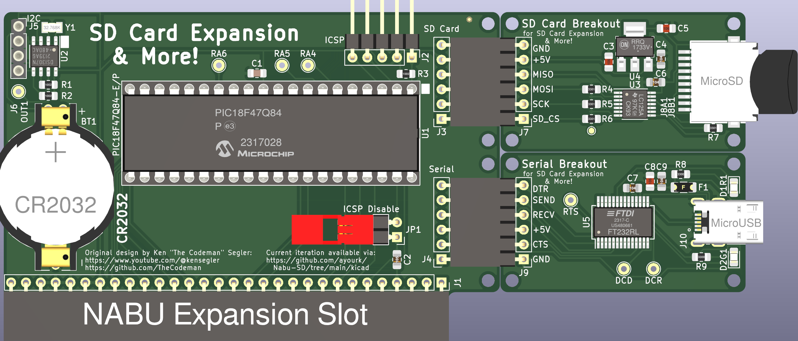

# SD Card Expansion & More!

Original design by Ken "The Codeman" Segler [Youtube](https://www.youtube.com/@kensegler) [Github](https://github.com/TheCodeman)

## Description

The goal of this project is to make the PIC into a WD compatible controller and function without any BIOS changes on the Nabu.  This means I'm going to have to learn how to write for the PIC in the project and what it takes to have it emulate a FDD/HDD controller as it uses the SD Card for storage.  The original project omitted the necessary flashable binary (or source) and links to the [SD Card](https://www.aliexpress.us/item/2251832622247273.html) and Serial Card breakout boards.

* A PDF version of the schematic can be found [here](Nabu-SD.pdf).
* Build of Materals (aka BOM) can be found [here](bom/ibom.html).

### PCB Layout

Some changes from the original by Ken "The Codeman" Segler:
* CR2032 battery - This is more common in PCs than the CR1220.
* The project was completely rebuilt in KiCAD 6.0.11.
* There are currently no Vias used with the 40-pin PDIP version of the PIC.
* I've focused on using more SMD parts where possible (except for the PIC) to make it easier to mass produce via a Fab House (e.g. [JLCPCB](https://www.jlcpcb.com/)).
* Corrected a few issues with the design with assistance from [@Stefanie80](https://github.com/Stefanie80).
* Created the SD Card and Serial Card breakouts and included them in schematic.  I am using UJ2-MIBH-4-SMT-TR because of the 3mm stick-out from the board.
* For the 2 Card breakouts, a lot of focus has been put into the amount of stick out of both the SD Card holder and the MicroUSB port so that a 3D Printed back plate can be used and still make it easy to remove a SD card or a MicroUSB cable.

## TODO:

* Write the PIC code with [MPLab X IDE](https://www.microchip.com/en-us/tools-resources/develop/mplab-x-ide)
* Create 3D Models (.step) for back plates for rear access to (1 or both) breakouts.
* Package everything up for [Arcade Shopper](https://www.arcadeshopper.com/) [Github](https://github.com/arcadeshopper) to sell.

Planned SD Card file naming scheme:  AHD12345.678
* A - Drive letter
* F or H - Floppy or HDD
* D or I - Usually "D", but use "I" for things like flux images. 
The rest will be some sort of amalgamation of Cylinders, Heads, Sectors.  This planned naming convention is subject to change depending on suggestions.

